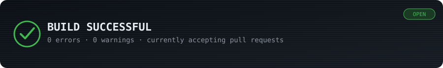

<div align="center">


<br/><br/>


</div>

<br/>

> This README doesn't have bugs. It has iterations. Everything below is one continuous pipeline — patch → review → tests → merge — because that's also just how I work.

<br/>

## `career.diff`

```diff
diff --git a/career.log b/career.log
--- a/career.log
+++ b/career.log
@@ -2016,3 +2016,7 @@ PKA Constructions — Business Analyst
- role: on-site fieldwork across 50+ construction sites
+ shipped: workforce-tracking SaaS, validated on the ground
+ impact: 90% adoption · idle labor cost -50%

@@ -2020,3 +2020,8 @@ Savax Credit Solutions — Product Manager
- role: single-market credit ops
+ shipped: B2B FinTech SaaS roadmap, audit-ready PRDs
+ impact: NPAs -20% YoY · upsells +25% · NPS +40% · onboarding time -30%
+ impact: sprint predictability +18% · zero compliance issues, 4 straight quarters

@@ -2025,2 +2025,5 @@ Handshake AI Solutions — AI/LLM Analyst
+ shipped: RLHF/SFT human-data evaluation across text, image, video, audio
+ impact: 8+ projects · 200+ tasks quality-reviewed · reduced bias & hallucination risk

@@ -2025,3 +2025,8 @@ MyEdMaster, LLC — Product Manager (current)
+ shipped: 0→1 AI virtual fitness coach — computer-vision coaching, live users
+ shipped: internal AI ops assistant (Slack/Jira/GA4/Amplitude)
+ impact: team effectiveness +15%
+ status: HEAD -> main, currently deployed
```

<br/>

## Open pull requests `(things I've actually shipped)`

<div align="center">

| PR | Product | State | Notes |
|:---|:---|:---:|:---|
| #1006 | **[Virtual Fitness Coach](https://www.myaigymcoach.com)** |  | Live · OpenAI-integrated · real users, web + mobile |
| #1002 | **[Rizo](https://rizobot.com)** — BYOK AI coding agent |  | VS Code Marketplace · Apache 2.0 · 6 providers via OpenRouter |
| #1003 | **[Mety Foundation](https://www.metyfoundation.org/)** |  | Self-assessment engine · ChatGPT + Cohere · AWS/GCP |
| #1005 | **Crowdfund dApp** |  | Solidity smart contract, deployed on Ethereum |
| #1006b | **[Portfolio](https://chaitanyaaggarwal.com)** |  | Next.js · TypeScript · Vercel |
| #1004 | **Finance Copilot** |  | Python/FastAPI + OpenAI API → transaction data into financial advice |

</div>

<br/>

## `package.json` `(dependencies added in this patch)`

```diff
--- a/package.json
+++ b/package.json
@@ dependencies @@
+ "product-strategy-and-roadmapping": "^7.0.0"
+ "0-to-1-development": "^6.0.0"
+ "llm-prompt-engineering": "^3.0.0"
+ "rag-pipelines": "^2.0.0"
+ "computer-vision-product-reqs": "^1.0.0"
+ "ab-testing": "^3.0.0"
+ "sql": "^5.0.0"
+ "python": "^4.0.0"
@@ devDependencies @@
+ "figma": "latest"
+ "jira + confluence": "latest"
+ "amplitude + ga4": "latest"
+ "aws + gcp": "latest"
```

<br/>

## test suite `(impact_metrics.spec)`

```text
 PASS  career/impact_metrics.spec

  ✔ non_performing_assets ............... -20% YoY
  ✔ enterprise_upsells .................. +25%
  ✔ customer_onboarding_time ............ -30%
  ✔ net_promoter_score .................. +40%
  ✔ sprint_predictability ............... +18%
  ✔ ai_ops_assistant_team_effectiveness . +15%
  ✔ workforce_saas_adoption ............. 90% (50+ sites)
  ✔ idle_labor_cost ..................... -50%
  ✔ feature_iteration_speed ............. 3x faster
  ✔ cumulative_business_impact .......... $1.8M+

  Tests:  10 passed, 10 total
  Status: all checks passed, ready to merge
```

<br/>

## achievements_unlocked `(badges.log)`


**education.log** — M.S. Engineering Management (STEM), George Washington University · GPA 3.80/4.00 · 2023–2025

<br/>

## `stats.render()`

<div align="center">


</div>

<!-- SNAKE_START -->
<div align="center">

</div>
<!-- SNAKE_END -->

<br/>

<details>
<summary>🔍&nbsp; <code>git blame README.md</code></summary>
<br/>

100% authored by one contributor. Zero co-authors. Eight years of commits, one very stubborn habit of shipping things that work.

Currently reviewing new pull requests — i.e., **Senior PM / AI PM roles**. Open one: chaitanyaaggarwal9@gmail.com

</details>

<br/>



<br/>

<div align="center">

[](https://chaitanyaaggarwal.com)
[](https://calendly.com/chaitanyaaggarwal9/30min)
[](https://linkedin.com/in/chaitanyaagg)
[](mailto:chaitanyaaggarwal9@gmail.com)
[](https://www.myaigymcoach.com)

<br/><br/>


</div>
